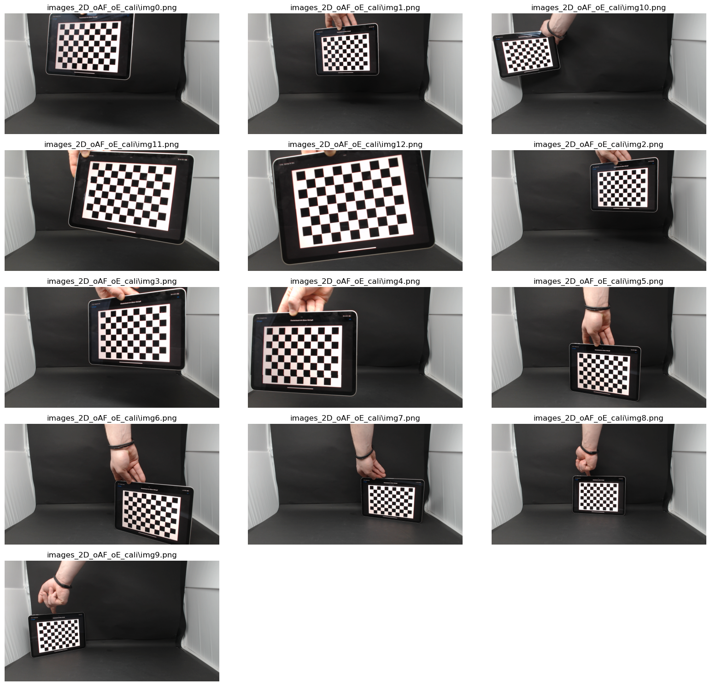
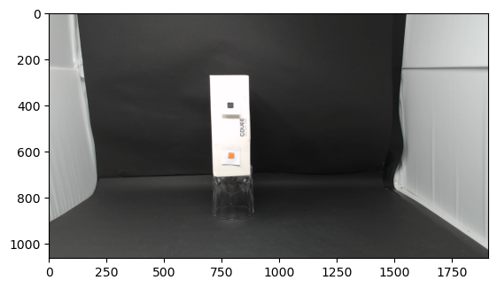
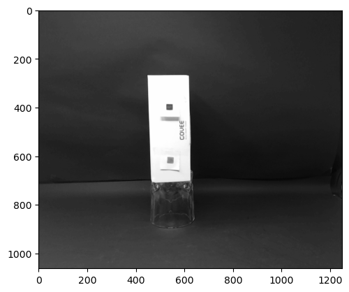
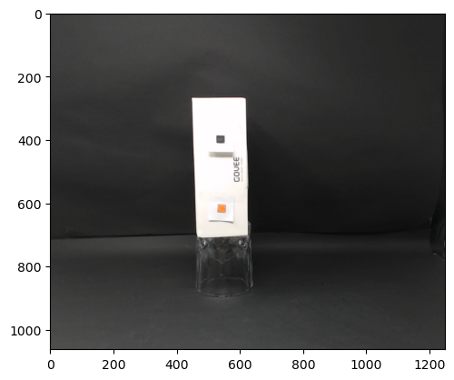
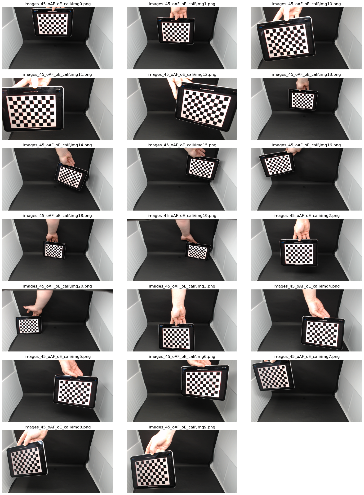
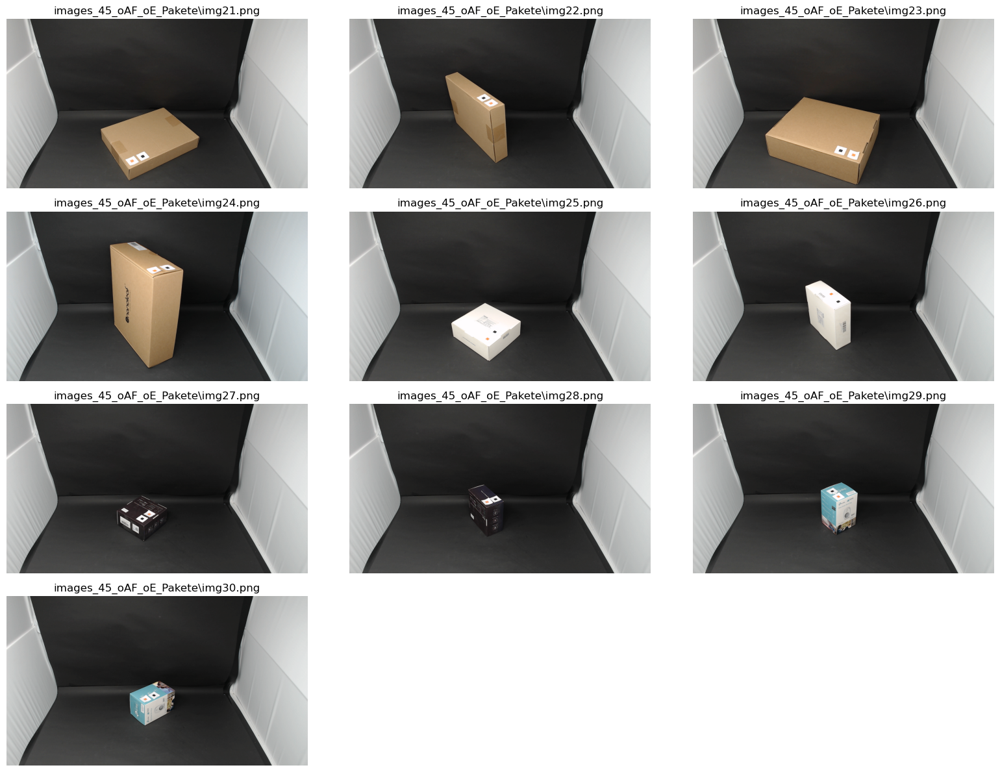
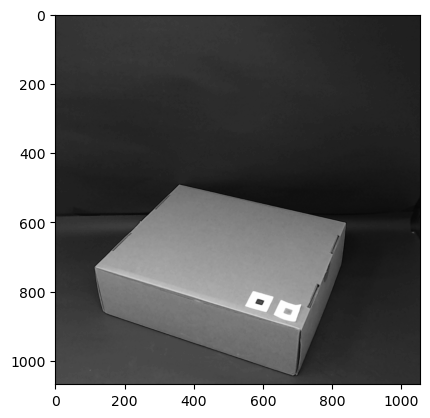
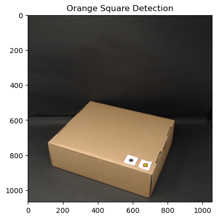

```python
import cv2 as cv
import numpy as np
import glob #gibt Dateipfade mit einer Musterübereinstimmung in einem Verzeichnis zurück.
import matplotlib.pyplot as plt
from skimage import io, color, filters, measure, morphology
import os
```


```python
def getImages(pathname, displayImages=False):
    
    if not os.path.exists(pathname):
        os.makedirs(pathname)
        print(f"Der Ordner {pathname} wurde erstellt.")
    
    width = 1920
    height = 1080

    cap = cv.VideoCapture(0)

    # Setzen Sie die Auflösung der Videoerfassung
    cap.set(cv.CAP_PROP_FRAME_WIDTH, width)  # 3 entspricht CV_CAP_PROP_FRAME_WIDTH
    cap.set(cv.CAP_PROP_FRAME_HEIGHT, height)
    cap.set(cv.CAP_PROP_AUTOFOCUS,0)
    cap.set(cv.CAP_PROP_AUTO_EXPOSURE, 0)  # 4 entspricht CV_CAP_PROP_FRAME_HEIGHT
    # cap.set(cv.CAP_PROP_EXPOSURE, -6) #https://www.principiaprogramatica.com/2017/06/11/setting-manual-exposure-in-opencv/

    num = 0

    while cap.isOpened():
        success, img = cap.read()

        k = cv.waitKey(5)
        savepath = f'{pathname}/img{str(num)}.png'

        if k == 27:  # ESC Button
            break
        elif k == ord('s'):  # wait for 's' key to save and exit
            cv.imwrite(savepath, img)
            print(f"{savepath} saved!")
            num += 1
            if(displayImages):
                plt.imshow(cv.cvtColor(img, cv.COLOR_BGR2RGB))
                plt.title(f"Bild {num}")
                plt.axis('off')
                plt.show()
        # Anzeige des Live-Video-Feeds
        cv.imshow("Live-Video-Feed", img)

    # Freigabe und Zerstörung aller Fenster vor der Beendigung
    cap.release()

```

Bilder für Kallibrierung holen


```python
# getImages('./test/')
```


```python
def showImagesFromFolder(pathname):
    # Überprüfen, ob der Ordner existiert
    if not os.path.exists(pathname):
        print(f"Der Ordner {pathname} existiert nicht.")
        return

    # Liste der Bildpfade im Ordner erhalten
    images = glob.glob(f'{pathname}/*.png')

    if not images:
        print("Es wurden keine Bilder im angegebenen Ordner gefunden.")
        return

    # Bilder nebeneinander anzeigen
    num_images = len(images)
    num_rows = (num_images + 2) // 3  # Aufgerundete Division
    num_cols = min(num_images, 3)

    plt.figure(figsize=(16, 3 * num_rows))
    for i, img_path in enumerate(images, start=1):
        img = cv.imread(img_path)
        img_rgb = cv.cvtColor(img, cv.COLOR_BGR2RGB)
        plt.subplot(num_rows, num_cols, i)
        plt.imshow(img_rgb)
        plt.title(img_path)
        plt.axis('off')
    plt.tight_layout()

    plt.show()

```


```python
showImagesFromFolder("images_2D_oAF_oE_cali")
```


    

    


```python
showImagesFromFolder('images_2D_oAF_oE_Pakete')
```


    

    


Kamera Kallibrieren


```python
def find_chessboard_corners(img, chessboard_size):
    gray = cv.cvtColor(img, cv.COLOR_BGR2GRAY)
    ret, corners = cv.findChessboardCorners(gray, chessboard_size, None)
    return ret, corners
```


```python
def refine_corners(img, corners, criteria):
    gray = cv.cvtColor(img, cv.COLOR_BGR2GRAY)
    corners_refined = cv.cornerSubPix(gray, corners, (11, 11), (-1, -1), criteria)
    return corners_refined
```


```python
def prepare_object_points(chessboard_size=(10,7)):
    objp = np.zeros((chessboard_size[0] * chessboard_size[1], 3), np.float32)
    objp[:,:2] = np.mgrid[0:chessboard_size[0],0:chessboard_size[1]].T.reshape(-1,2)

    size_of_chessboard_squares_mm = 20
    objp = objp * size_of_chessboard_squares_mm
    return objp
```


```python

def collect_object_and_image_points(pathname, chessboard_size, objp, draw=True):
    criteria = (cv.TERM_CRITERIA_EPS + cv.TERM_CRITERIA_MAX_ITER, 30, 0.001)
    objpoints = [] # 3d point in real world space
    imgpoints = [] # 2d points in image plane.
    
    
    images = glob.glob(f'{pathname}/*.png')
    
    num_images = len(images)
    num_rows = (num_images + 2) // 3  # Aufgerundete Division
    num_cols = min(num_images, 3)

    if draw:
        fig, axes = plt.subplots(num_rows, num_cols,figsize=(16, 3 * num_rows), constrained_layout=True)
    
    
    for i, image in enumerate(images):
        img = cv.imread(image)
        ret, corners = find_chessboard_corners(img, chessboard_size)

        if ret:
            corners_refined = refine_corners(img, corners, criteria)
            objpoints.append(objp)
            imgpoints.append(corners_refined)
            if draw:
                cv.drawChessboardCorners(img, chessboard_size, corners_refined, ret)
                axes[i // num_cols, i % num_cols].imshow(cv.cvtColor(img, cv.COLOR_BGR2RGB))
                axes[i // num_cols, i % num_cols].set_title(image)
                axes[i // num_cols, i % num_cols].axis('off')
    if draw:    
        for i in range(num_images, num_rows * num_cols):
            row_idx = i // num_cols
            col_idx = i % num_cols
            axes[row_idx, col_idx].axis('off')
        plt.tight_layout()
        plt.show()
    
    
    return objpoints, imgpoints
    

```


```python
def calibrate(pathname, image_path, chessboard_size=(10,7),frame_size=(1920,1080), draw=True, print_error=True):
    objp = prepare_object_points(chessboard_size)

    objpoints, imgpoints = collect_object_and_image_points(pathname, chessboard_size, objp, draw=draw)
    
    ret, camera_matrix, dist_coeff, rvecs, tvecs = cv.calibrateCamera(objpoints, imgpoints, frame_size, None, None)
    
    img = cv.imread(image_path)
    h,  w = img.shape[:2]
    newCameraMatrix, roi = cv.getOptimalNewCameraMatrix(camera_matrix, dist_coeff, (w,h), 1, (w,h))

    # Undistort
    dst = cv.undistort(img, camera_matrix, dist_coeff, None, newCameraMatrix)

    # crop the image
    x, y, w, h = roi
    dst = dst[y:y+h, x:x+w]
    
    if print_error:
        mean_error = 0

        for i in range(len(objpoints)):
            imgpoints2, _ = cv.projectPoints(objpoints[i], rvecs[i], tvecs[i], camera_matrix, dist_coeff)
            error = cv.norm(imgpoints[i], imgpoints2, cv.NORM_L2)/len(imgpoints2)
            mean_error += error

        print("total error: {}".format(mean_error/len(objpoints))) 
    
    return dst   


```


```python
calibrated_img = calibrate(pathname='images_2D_oAF_oE_cali', image_path='images_2D_oAF_oE_Pakete/img7.png', draw=False)

print(calibrated_img.shape)
plt.imshow(cv.cvtColor(calibrated_img, cv.COLOR_BGR2RGB))
plt.show()
```

    total error: 0.04193406354657396
    (1062, 1909, 3)


    

    


```python
def prepare_Image(image, margin_right:int, margin_left:int, draw=True):
    image = image[:, margin_left:margin_right]

    gray_image = color.rgb2gray(image)

    image = cv.cvtColor(image, cv.COLOR_BGR2RGB)

    if draw:
        plt.imshow(image)
        plt.show()
        plt.imshow(gray_image, cmap='gray')
        plt.show()

    return gray_image, image
```


```python
def get_Binary_Image_2D(image, draw=True):
    thresh = filters.threshold_otsu(image)
    binary_image = image > thresh

    if draw:
        plt.imshow(binary_image, cmap='gray')
        plt.show()
    return binary_image
```


```python
def get_Largest_Region_2D(binary_image):
    labeled_image = measure.label(binary_image)

    regions = measure.regionprops(labeled_image)
    
    print(f'Found {len(regions)} Regions')

    largest_region = max(regions, key=lambda region: region.area)
    
    return largest_region
```


```python
def get_Edge_Lenght_2D(prepared_image, draw_Binary=True, draw_Final=True):
    binary_image = get_Binary_Image_2D(prepared_image, draw=draw_Binary)

    largest_region = get_Largest_Region_2D(binary_image)

    minr, minc, maxr, maxc = largest_region.bbox

    width = maxc - minc
    height = maxr - minr
    
    print(f'Kantenlänge (Breite): {width} Pixel')
    print(f'Kantenlänge (Höhe): {height} Pixel')
    
    if draw_Final:
        fig, ax = plt.subplots()
        ax.imshow(prepared_image, cmap='gray')
        rect = plt.Rectangle((minc, minr), maxc - minc, maxr - minr, fill=False, edgecolor='red', linewidth=2)
        ax.add_patch(rect)
        plt.show()

    return width, height

```


```python

prepared_image_gray, prepared_image_rgb = prepare_Image(calibrated_img, margin_right = -410, margin_left = 250, draw=True)
width, height = get_Edge_Lenght_2D(prepared_image_gray, draw_Final=True, draw_Binary=True)
```


    

    


    

    


    

    


    Found 12 Regions
    Kantenlänge (Breite): 178 Pixel
    Kantenlänge (Höhe): 442 Pixel


    

    


```python
def get_Orange_Square_Lenght_2D(prepared_image, draw_binary=True, draw_final=True):
    
    plt.imshow(prepared_image)
    plt.show()

    # Definieren Sie den Farbbereich für Orange im RGB-Farbraum
    lower_orange = np.array([200, 100, 0], dtype=np.uint8)
    upper_orange = np.array([255, 200, 100], dtype=np.uint8)

    # Erstellen Sie ein binäres Bild, das den orangefarbenen Bereich enthält
    binary_image = cv.inRange(prepared_image, lower_orange, upper_orange)


    if draw_binary:
        plt.imshow(binary_image, cmap='gray')
        plt.show()
    
    largest_region = get_Largest_Region_2D(binary_image)

    minr, minc, maxr, maxc = largest_region.bbox

    width = maxc - minc
    height = maxr - minr

    len_mean = int(round((width + height) / 2, 0)) 
    
    print(f'Kantenlänge (Mean): {len_mean} Pixel')
    
    if draw_final:
        fig, ax = plt.subplots()
        ax.imshow(prepared_image, cmap='gray')
        rect = plt.Rectangle((minc, minr), len_mean, len_mean, fill=False, edgecolor='red', linewidth=2)
        ax.add_patch(rect)
        plt.show()

    return len_mean
```


```python
len_1cm_mean = get_Orange_Square_Lenght_2D(prepared_image_rgb)
```


    

    


    

    


    Found 1 Regions
    Kantenlänge (Mean): 22 Pixel


    

    


```python
 
width_cm = width / len_1cm_mean
height_cm = height / len_1cm_mean

# Drucken Sie die Ergebnisse
print(f'Kantenlänge (Breite): {width_cm:.2f} cm')
print(f'Kantenlänge (Höhe): {height_cm:.2f} cm')

```

    Kantenlänge (Breite): 8.09 cm
    Kantenlänge (Höhe): 20.09 cm


# Kalibrate 3D


```python
showImagesFromFolder('images_45_oAF_oE_cali')
showImagesFromFolder('images_45_oAF_oE_Pakete')

calibrated_img_3D = calibrate(pathname='images_45_oAF_oE_cali', image_path='images_45_oAF_oE_Pakete/img23.png', draw=False)

#img25 originale Maße 17x17x6
#img23 originale Maße 25x31x9.5
print(calibrated_img_3D.shape)
plt.imshow(cv.cvtColor(calibrated_img_3D, cv.COLOR_BGR2RGB))
plt.show()
```


    

    


    

    


    total error: 0.032820495968905676
    (1068, 1915, 3)


    

    


```python
def find_edges_3D(gray_image, draw=True):
    edges = cv.Canny(gray_image, 50, 150)

    if draw:
        plt.imshow(edges)
        plt.show()

    return edges
```


```python
def find_largest_Contour_3D(edges):
    # Finde Konturen im Bild
    contours, _ = cv.findContours(edges, cv.RETR_EXTERNAL, cv.CHAIN_APPROX_SIMPLE)
    
    # Sortiere die Konturen nach der Fläche
    contours = sorted(contours, key=cv.contourArea, reverse=True)
    
    # Wähle die größte Kontur aus
    largest_contour = contours[0]
    return largest_contour
```


```python
def approximate_contour_3D(largest_contour):
    epsilon = 0.01 * cv.arcLength(largest_contour, True)
    approx = cv.approxPolyDP(largest_contour, epsilon, True)

    # Sortiere die approximierten Punkte im Uhrzeigersinn
    center = tuple(np.mean(approx, axis=0)[0])
    approx = sorted(approx, key=lambda point: np.arctan2(point[0][1] - center[1], point[0][0] - center[0]))
    return approx
```


```python
def get_Edge_Lenght_3D(prepared_Image_Gray, prepared_Image_RGB, draw=True):
    edges = find_edges_3D(prepared_Image_Gray, draw=draw)
    largest_contour = find_largest_Contour_3D(edges)

    approx = approximate_contour_3D(largest_contour)

    colors = [np.array([0, 0, 255]), np.array([0, 255, 0]), np.array([255, 0, 0]),
              np.array([255, 255, 0]), np.array([0, 255, 255]), np.array([255, 0, 255])]
    
    lenghts = dict()

    if draw:
        plt.figure(figsize=(10, 10))

        # Zeichne das Bild
        plt.imshow(cv.cvtColor(prepared_Image_RGB, cv.COLOR_BGR2RGB))

        for i in range(len(approx)):
            start_point = approx[i][0]
            end_point = approx[(i + 1) % len(approx)][0]
            color = colors[i]

            # Berechnung der Länge jeder Kante
            length_pixels = int(np.sqrt((end_point[0] - start_point[0])**2 + (end_point[1] - start_point[1])**2))
            print(f"Kante {i + 1}: Länge = {length_pixels} Pixel, Farbe = {color}")
            lenghts[i] = length_pixels

            # Linien auf das Bild zeichnen
            plt.plot([start_point[0], end_point[0]], [start_point[1], end_point[1]], linewidth=2, color=color/255)

        plt.title('Image with Smoothed Lines')
        plt.axis('off')  # Achsen verstecken
        plt.show()
    
    height_mean = int(round((lenghts[2] + lenghts[5]) / 2, 0))
    length_mean = int(round((lenghts[1] + lenghts[4]) / 2, 0))
    depth_mean = int(round((lenghts[0] + lenghts[3]) / 2, 0))
    return height_mean, length_mean, depth_mean
```


```python
prepared_image_gray_3D, prepared_image_rgb_3D = prepare_Image(calibrated_img_3D, margin_left=350, margin_right=-510, draw=True)

prepared_image_gray_3D_Edge = cv.cvtColor(prepared_image_rgb_3D, cv.COLOR_BGR2GRAY)

prepared_image_rgb_3D_Edge = cv.cvtColor(prepared_image_rgb_3D, cv.COLOR_BGR2RGB)

height_mean, length_mean, depth_mean = get_Edge_Lenght_3D(prepared_image_gray_3D_Edge, prepared_image_rgb_3D_Edge)

print(height_mean, length_mean, depth_mean)
```


    

    


    

    


    

    


    Kante 1: Länge = 339 Pixel, Farbe = [  0   0 255]
    Kante 2: Länge = 493 Pixel, Farbe = [  0 255   0]
    Kante 3: Länge = 121 Pixel, Farbe = [255   0   0]
    Kante 4: Länge = 343 Pixel, Farbe = [255 255   0]
    Kante 5: Länge = 579 Pixel, Farbe = [  0 255 255]
    Kante 6: Länge = 137 Pixel, Farbe = [255   0 255]


    

    


    129 536 341


```python
def get_Orange_Square_Lenght_3D(prepared_image):
    # Convert the image to the HSV color space using cv2
    hsv_image = cv.cvtColor(prepared_image, cv.COLOR_RGB2HSV)

    # Define a range for orange in HSV
    # These ranges will likely need to be adjusted
    lower_orange = np.array([5, 100, 100])
    upper_orange = np.array([15, 255, 255])

    # Threshold the HSV image to get only orange colors
    mask = cv.inRange(hsv_image, lower_orange, upper_orange)

    # Find contours in the mask
    contours, _ = cv.findContours(mask, cv.RETR_TREE, cv.CHAIN_APPROX_SIMPLE)

    # Find the largest contour assuming it is the orange square
    largest_contour = max(contours, key=cv.contourArea)

    # Draw the contour on the original image
    cv.drawContours(prepared_image, [largest_contour], -1, (0, 255, 0), 3)

    # Calculate the bounding rectangle of the largest contour
    x, y, w, h = cv.boundingRect(largest_contour)

    # Draw the bounding rectangle on the original image
    cv.rectangle(prepared_image, (x, y), (x+w, y+h), (255, 0, 0), 2)

    # Display the original image with the contour and bounding box
    plt.imshow(prepared_image)
    plt.title('Orange Square Detection')
    plt.show()

    # Return the dimensions of the bounding box as well
    return int(round((w+h) / 2, 0))
```


```python
len_1cm_mean_3D = get_Orange_Square_Lenght_3D(prepared_image_rgb_3D)

lenght_cm_3D = length_mean / len_1cm_mean_3D
height_cm_3D = height_mean / len_1cm_mean_3D
depth_cm_3D = depth_mean / len_1cm_mean_3D

# Drucken Sie die Ergebnisse
print(f'Kantenlänge (Länge): {lenght_cm_3D:.2f} cm')
print(f'Kantenlänge (Höhe): {height_cm_3D:.2f} cm')
print(f'Kantenlänge (Tiefe): {depth_cm_3D:.2f} cm')


```


    

    


    Kantenlänge (Länge): 26.80 cm
    Kantenlänge (Höhe): 6.45 cm
    Kantenlänge (Tiefe): 17.05 cm

